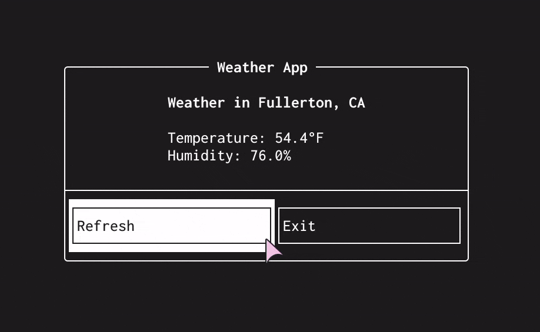

# cpp-tui-workshop

<div align="center">
  
</div>

- What is: This is a workshop on making a simple and easy but pretty terminal
  user-interface (TUI) in C++.
- What for: This is for ACM at CSUF's Spring 2024 Dev Workshop.

## Building

You can either use Nix or manually find all the dependencies yourself :)

### Building with Nix

Nix will automatically fetch the needed dependencies and build the project
using [CMake](https://cmake.org/).

```sh
nix build .#
```

To run, you can either use `nix run` and skip building entirely or run
`./result/bin/cpp-tui-workshop`.

### Building Manually

These are the dependencies you will need:

- [ftxui](https://github.com/ArthurSonzogni/FTXUI)
- [libcpr](https://github.com/libcpr/cpr)
- [nlohmann/json](https://github.com/nlohmann/json)
- [cmake](https://cmake.org/)

Then you can build the project with CMake:

```sh
cmake .
cmake --build .
```

To run, you can run `./cpp-tui-workshop`.
